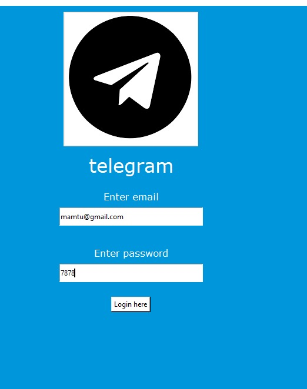

# login_page_via_tkinter

A simple login page GUI built with Tkinter and Pillow in Python.




## Features

- Login form with email and password fields
- Telegram-themed icon and styling
- Success and error message dialogs

## Requirements

- Python 3.x
- Tkinter (usually included with Python)
- Pillow (`pip install pillow`)

## Usage

1. Place `telegram.py`, `tg.png`, and `favicorn.ico` in the same directory.
2. Run the script:

   ```sh
   python telegram.py# login_page_via_tkinter
3. Use the following credentials to log in:
   Email: mamtu@gmail.com
   Password: 7878   

## Files
  - telegram.py: Main application code
  - tg.png: Telegram icon for the GUI
  - favicorn.ico: Window icon
  - README.md: Project documentation   